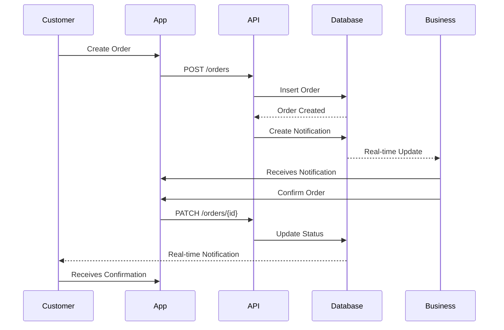
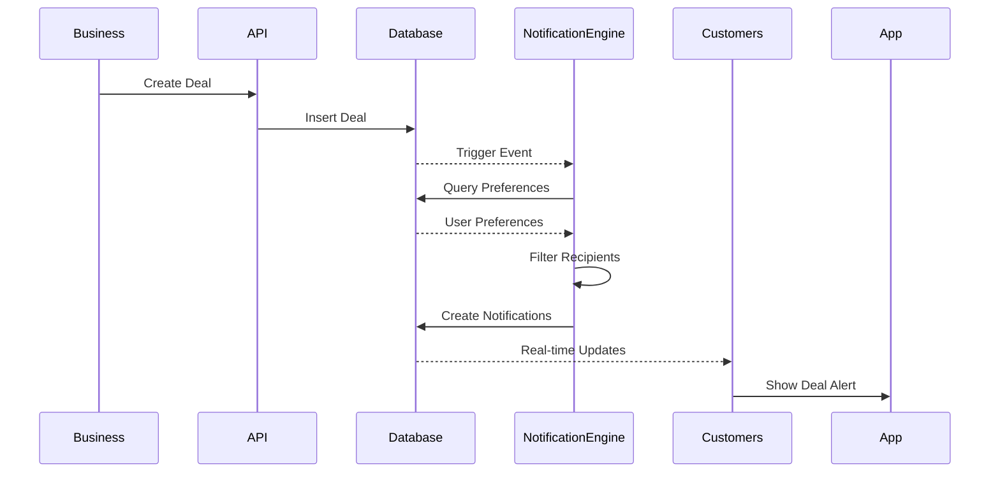

# FoodQ Notification System Design

## Executive Summary
A comprehensive, event-driven notification system for FoodQ that provides real-time updates to customers and business users through multiple delivery channels. The system follows the separation of concerns principle implemented in NoenCircles with enhanced capabilities for order lifecycle management and business-customer communication.

## System Architecture

### Core Components

#### 1. Event Source Layer
**Purpose**: Capture all business events that require notifications

**Event Sources**:
- **Order Events**: Order creation, payment, confirmation, preparation, ready, completion, cancellation
- **Deal Events**: New deals, expiring deals, sold out deals, price changes
- **Business Events**: Opening hours changes, menu updates, temporary closures
- **System Events**: Maintenance, announcements, platform updates

**Implementation**:
```typescript
// Event Types
enum EventType {
  // Order Events
  ORDER_CREATED = 'order.created',
  ORDER_PAID = 'order.paid',
  ORDER_CONFIRMED = 'order.confirmed',
  ORDER_PREPARING = 'order.preparing',
  ORDER_READY = 'order.ready',
  ORDER_COMPLETED = 'order.completed',
  ORDER_CANCELLED = 'order.cancelled',
  
  // Deal Events
  DEAL_CREATED = 'deal.created',
  DEAL_EXPIRING = 'deal.expiring',
  DEAL_SOLD_OUT = 'deal.sold_out',
  DEAL_PRICE_CHANGED = 'deal.price_changed',
  
  // Business Events
  BUSINESS_HOURS_CHANGED = 'business.hours_changed',
  BUSINESS_MENU_UPDATED = 'business.menu_updated',
  BUSINESS_TEMPORARILY_CLOSED = 'business.closed',
}

// Event Structure
interface NotificationEvent {
  id: string;
  type: EventType;
  timestamp: DateTime;
  payload: EventPayload;
  metadata: EventMetadata;
}
```

#### 2. Message Composition Layer
**Purpose**: Transform events into user-friendly notification messages

**Components**:
- **Template Engine**: Dynamic message generation based on event type and user preferences
- **Localization Service**: Multi-language support
- **Content Personalization**: User-specific messaging
- **Rich Media Handler**: Images, QR codes, action buttons

**Message Types**:
```typescript
interface NotificationMessage {
  id: string;
  recipientId: string;
  recipientType: 'customer' | 'business' | 'staff';
  type: NotificationType;
  title: string;
  message: string;
  data?: {
    orderId?: string;
    dealId?: string;
    businessId?: string;
    qrCode?: string;
    verificationCode?: string;
    imageUrl?: string;
  };
  priority: 'low' | 'normal' | 'high' | 'urgent';
  channels: DeliveryChannel[];
  expiresAt?: DateTime;
  actions?: NotificationAction[];
}
```

#### 3. Recipient Resolution Layer
**Purpose**: Determine who should receive notifications based on business rules

**Rules Engine**:
- **Order Notifications**:
  - Customer: All order status changes
  - Business Owner: New orders, cancellations
  - Staff: Assigned orders, ready for pickup
  
- **Deal Notifications**:
  - Customers: Based on preferences, location, past orders
  - Businesses: Deal performance, low inventory alerts

**Recipient Filters**:
```typescript
interface RecipientFilter {
  userType: UserType;
  location?: GeoPoint;
  preferences?: NotificationPreferences;
  businessRelation?: string[];
  orderHistory?: OrderCriteria;
}
```

#### 4. Delivery Mechanism Layer
**Purpose**: Multi-channel notification delivery with fallback strategies

**Channels**:
1. **In-App (Primary)**:
   - Real-time WebSocket updates via Supabase
   - Persistent notification center
   - Badge counts and indicators

2. **Push Notifications**:
   - FCM for Android
   - APNs for iOS
   - Web Push for PWAs

3. **Email** (Future):
   - Transactional emails for critical updates
   - Daily/weekly digests

4. **SMS** (Future):
   - Order confirmations
   - Pickup reminders

**Delivery Strategy**:
```typescript
interface DeliveryStrategy {
  primary: DeliveryChannel;
  fallback?: DeliveryChannel[];
  retryPolicy: {
    maxAttempts: number;
    backoffMs: number;
  };
  tracking: {
    sent: boolean;
    delivered: boolean;
    read: boolean;
    clicked: boolean;
  };
}
```

## Database Schema

### Notifications Table
```sql
CREATE TABLE notifications (
  id UUID PRIMARY KEY DEFAULT uuid_generate_v4(),
  
  -- Event Information
  event_id UUID NOT NULL,
  event_type TEXT NOT NULL,
  
  -- Recipient Information
  recipient_id UUID NOT NULL REFERENCES auth.users(id),
  recipient_type TEXT NOT NULL CHECK (recipient_type IN ('customer', 'business', 'staff')),
  
  -- Message Content
  type TEXT NOT NULL,
  title TEXT NOT NULL,
  message TEXT NOT NULL,
  data JSONB,
  image_url TEXT,
  
  -- Metadata
  priority TEXT DEFAULT 'normal' CHECK (priority IN ('low', 'normal', 'high', 'urgent')),
  channels TEXT[] DEFAULT ARRAY['in_app'],
  
  -- Status Tracking
  status TEXT DEFAULT 'pending' CHECK (status IN ('pending', 'sent', 'delivered', 'failed')),
  is_read BOOLEAN DEFAULT FALSE,
  read_at TIMESTAMP WITH TIME ZONE,
  clicked_at TIMESTAMP WITH TIME ZONE,
  
  -- Timestamps
  created_at TIMESTAMP WITH TIME ZONE DEFAULT CURRENT_TIMESTAMP,
  updated_at TIMESTAMP WITH TIME ZONE DEFAULT CURRENT_TIMESTAMP,
  expires_at TIMESTAMP WITH TIME ZONE,
  
  -- Indexes
  CONSTRAINT fk_recipient FOREIGN KEY (recipient_id) REFERENCES auth.users(id) ON DELETE CASCADE
);

-- Indexes for performance
CREATE INDEX idx_notifications_recipient ON notifications(recipient_id, is_read, created_at DESC);
CREATE INDEX idx_notifications_type ON notifications(type, created_at DESC);
CREATE INDEX idx_notifications_event ON notifications(event_id, event_type);
CREATE INDEX idx_notifications_expires ON notifications(expires_at) WHERE expires_at IS NOT NULL;
```

### Notification Preferences Table
```sql
CREATE TABLE notification_preferences (
  user_id UUID PRIMARY KEY REFERENCES auth.users(id),
  
  -- Channel Preferences
  channels JSONB DEFAULT '{
    "in_app": true,
    "push": true,
    "email": false,
    "sms": false
  }',
  
  -- Type Preferences
  types JSONB DEFAULT '{
    "orders": true,
    "deals": true,
    "business_updates": true,
    "system": true
  }',
  
  -- Quiet Hours
  quiet_hours JSONB DEFAULT '{
    "enabled": false,
    "start": "22:00",
    "end": "08:00",
    "timezone": "America/New_York"
  }',
  
  -- Deal Preferences
  deal_preferences JSONB DEFAULT '{
    "categories": [],
    "max_distance_km": 10,
    "min_discount_percent": 20,
    "favorite_businesses_only": false
  }',
  
  created_at TIMESTAMP WITH TIME ZONE DEFAULT CURRENT_TIMESTAMP,
  updated_at TIMESTAMP WITH TIME ZONE DEFAULT CURRENT_TIMESTAMP
);
```

### Push Tokens Table
```sql
CREATE TABLE push_tokens (
  id UUID PRIMARY KEY DEFAULT uuid_generate_v4(),
  user_id UUID NOT NULL REFERENCES auth.users(id),
  token TEXT NOT NULL,
  platform TEXT NOT NULL CHECK (platform IN ('ios', 'android', 'web')),
  device_id TEXT,
  is_active BOOLEAN DEFAULT TRUE,
  last_used_at TIMESTAMP WITH TIME ZONE,
  created_at TIMESTAMP WITH TIME ZONE DEFAULT CURRENT_TIMESTAMP,
  updated_at TIMESTAMP WITH TIME ZONE DEFAULT CURRENT_TIMESTAMP,
  
  UNIQUE(user_id, token)
);
```

## Real-time Implementation

### Supabase Real-time Subscriptions
```typescript
// Customer subscribes to their notifications
const customerSubscription = supabase
  .channel('customer-notifications')
  .on(
    'postgres_changes',
    {
      event: 'INSERT',
      schema: 'public',
      table: 'notifications',
      filter: `recipient_id=eq.${customerId}`
    },
    (payload) => handleNewNotification(payload.new)
  )
  .subscribe();

// Business subscribes to order notifications
const businessSubscription = supabase
  .channel('business-orders')
  .on(
    'postgres_changes',
    {
      event: '*',
      schema: 'public',
      table: 'orders',
      filter: `business_id=eq.${businessId}`
    },
    (payload) => handleOrderUpdate(payload)
  )
  .subscribe();
```

### Database Triggers for Event Generation
```sql
-- Trigger for order status changes
CREATE OR REPLACE FUNCTION notify_order_status_change()
RETURNS TRIGGER AS $$
BEGIN
  -- When order is paid, notify business
  IF NEW.status = 'paid' AND OLD.status = 'pending' THEN
    INSERT INTO notifications (
      event_id, event_type, recipient_id, recipient_type,
      type, title, message, data, priority
    )
    SELECT
      NEW.id, 'ORDER_PAID', b.owner_id, 'business',
      'order_paid', 'New Order!',
      'You have a new order #' || SUBSTRING(NEW.id::TEXT, 1, 8) || ' for $' || NEW.total_amount,
      jsonb_build_object(
        'orderId', NEW.id,
        'customerId', NEW.user_id,
        'amount', NEW.total_amount
      ),
      'high'
    FROM businesses b
    WHERE b.id = NEW.business_id;
  END IF;
  
  -- When order is confirmed, notify customer
  IF NEW.status = 'confirmed' AND OLD.status = 'paid' THEN
    INSERT INTO notifications (
      event_id, event_type, recipient_id, recipient_type,
      type, title, message, data, priority
    )
    VALUES (
      NEW.id, 'ORDER_CONFIRMED', NEW.user_id, 'customer',
      'order_confirmed', 'Order Confirmed!',
      'Your order has been confirmed. Pickup code: ' || NEW.verification_code,
      jsonb_build_object(
        'orderId', NEW.id,
        'verificationCode', NEW.verification_code,
        'qrCode', NEW.qr_code
      ),
      'high'
    );
  END IF;
  
  -- When order is ready, notify customer
  IF NEW.status = 'ready' AND OLD.status IN ('confirmed', 'preparing') THEN
    INSERT INTO notifications (
      event_id, event_type, recipient_id, recipient_type,
      type, title, message, data, priority
    )
    VALUES (
      NEW.id, 'ORDER_READY', NEW.user_id, 'customer',
      'order_ready', 'Order Ready for Pickup!',
      'Your order is ready! Show this code at pickup: ' || NEW.verification_code,
      jsonb_build_object(
        'orderId', NEW.id,
        'verificationCode', NEW.verification_code
      ),
      'urgent'
    );
  END IF;
  
  -- When order is completed, notify both parties
  IF NEW.status = 'completed' AND OLD.status != 'completed' THEN
    -- Notify customer
    INSERT INTO notifications (
      event_id, event_type, recipient_id, recipient_type,
      type, title, message, priority
    )
    VALUES (
      NEW.id, 'ORDER_COMPLETED', NEW.user_id, 'customer',
      'order_completed', 'Order Complete!',
      'Thank you for your order! We hope you enjoy your meal.',
      'normal'
    );
    
    -- Notify business
    INSERT INTO notifications (
      event_id, event_type, recipient_id, recipient_type,
      type, title, message, data, priority
    )
    SELECT
      NEW.id, 'ORDER_COMPLETED', b.owner_id, 'business',
      'order_completed', 'Order Completed',
      'Order #' || SUBSTRING(NEW.id::TEXT, 1, 8) || ' has been completed.',
      jsonb_build_object('orderId', NEW.id, 'amount', NEW.total_amount),
      'low'
    FROM businesses b
    WHERE b.id = NEW.business_id;
  END IF;
  
  RETURN NEW;
END;
$$ LANGUAGE plpgsql;

CREATE TRIGGER order_status_notification_trigger
AFTER UPDATE OF status ON orders
FOR EACH ROW
EXECUTE FUNCTION notify_order_status_change();
```

## Service Implementation

### Backend Notification Service (Cloudflare Worker)
```typescript
// /functions/api/notifications/send.ts
export async function onRequestPost(context) {
  const { event, recipients, message, options } = await context.request.json();
  
  // Validate event and recipients
  if (!validateEvent(event) || !recipients.length) {
    return new Response('Invalid request', { status: 400 });
  }
  
  // Process each recipient
  const notifications = await Promise.all(
    recipients.map(async (recipientId) => {
      // Check user preferences
      const prefs = await getUserPreferences(recipientId);
      
      // Skip if user has disabled this type
      if (!shouldNotify(prefs, event.type)) {
        return null;
      }
      
      // Create notification record
      const notification = await createNotification({
        eventId: event.id,
        eventType: event.type,
        recipientId,
        ...message,
        channels: determineChannels(prefs, options.priority)
      });
      
      // Queue for delivery
      await queueForDelivery(notification);
      
      return notification;
    })
  );
  
  return new Response(JSON.stringify({
    sent: notifications.filter(Boolean).length,
    total: recipients.length
  }));
}
```

### Frontend Integration (Flutter)
```dart
// Enhanced notification service with event handling
class NotificationService {
  final SupabaseClient _supabase;
  final Map<String, StreamSubscription> _subscriptions = {};
  
  // Subscribe to all notification events for a user
  void subscribeToNotifications(String userId) {
    // Real-time notifications
    _subscriptions['notifications'] = _supabase
        .from('notifications')
        .stream(primaryKey: ['id'])
        .eq('recipient_id', userId)
        .listen((data) {
          for (final notification in data) {
            _handleNotification(AppNotification.fromJson(notification));
          }
        });
    
    // Order updates (for business users)
    if (isBusinessUser) {
      _subscriptions['orders'] = _supabase
          .from('orders')
          .stream(primaryKey: ['id'])
          .eq('business_id', businessId)
          .listen((data) {
            _handleOrderUpdate(data);
          });
    }
  }
  
  void _handleNotification(AppNotification notification) {
    // Update local state
    _updateNotificationState(notification);
    
    // Show in-app notification
    if (notification.priority == NotificationPriority.urgent) {
      _showUrgentNotification(notification);
    } else {
      _showStandardNotification(notification);
    }
    
    // Update badge count
    _updateBadgeCount();
    
    // Trigger haptic feedback for important notifications
    if (notification.isHighPriority) {
      HapticFeedback.mediumImpact();
    }
  }
  
  Future<void> sendOrderNotification(Order order, OrderStatus newStatus) async {
    // Determine recipients based on status change
    final recipients = await _determineRecipients(order, newStatus);
    
    // Create appropriate message
    final message = _createOrderMessage(order, newStatus);
    
    // Send via API
    await _apiClient.post('/api/notifications/send', {
      'event': {
        'id': order.id,
        'type': 'ORDER_${newStatus.name.toUpperCase()}',
      },
      'recipients': recipients,
      'message': message,
      'options': {
        'priority': _getPriorityForStatus(newStatus),
      }
    });
  }
}
```

## Notification Workflows

### 1. Order Creation Flow


### 2. Deal Notification Flow


## Push Notification Setup

### Firebase Cloud Messaging Configuration
```dart
// lib/features/notifications/services/push_notification_service.dart
class PushNotificationService {
  final FirebaseMessaging _fcm = FirebaseMessaging.instance;
  
  Future<void> initialize() async {
    // Request permissions
    final settings = await _fcm.requestPermission(
      alert: true,
      badge: true,
      sound: true,
    );
    
    if (settings.authorizationStatus == AuthorizationStatus.authorized) {
      // Get token
      final token = await _fcm.getToken();
      if (token != null) {
        await _savePushToken(token);
      }
      
      // Listen for token refresh
      _fcm.onTokenRefresh.listen(_savePushToken);
      
      // Handle foreground messages
      FirebaseMessaging.onMessage.listen(_handleForegroundMessage);
      
      // Handle background messages
      FirebaseMessaging.onBackgroundMessage(_handleBackgroundMessage);
      
      // Handle notification taps
      FirebaseMessaging.onMessageOpenedApp.listen(_handleNotificationTap);
    }
  }
  
  Future<void> _savePushToken(String token) async {
    await _supabase.from('push_tokens').upsert({
      'user_id': currentUserId,
      'token': token,
      'platform': Platform.isIOS ? 'ios' : 'android',
      'device_id': await _getDeviceId(),
      'last_used_at': DateTime.now().toIso8601String(),
    });
  }
}
```

## Performance Optimizations

### 1. Batching and Throttling
```typescript
class NotificationBatcher {
  private queue: Map<string, NotificationMessage[]> = new Map();
  private timer: NodeJS.Timeout;
  
  add(userId: string, notification: NotificationMessage) {
    if (!this.queue.has(userId)) {
      this.queue.set(userId, []);
    }
    this.queue.get(userId)!.push(notification);
    
    // Start batch timer if not running
    if (!this.timer) {
      this.timer = setTimeout(() => this.flush(), 1000);
    }
  }
  
  async flush() {
    for (const [userId, notifications] of this.queue) {
      await this.sendBatch(userId, notifications);
    }
    this.queue.clear();
    this.timer = null;
  }
}
```

### 2. Caching Strategy
```dart
class NotificationCache {
  static const int maxCacheSize = 100;
  static const Duration cacheExpiry = Duration(hours: 24);
  
  final Map<String, CachedNotification> _cache = {};
  
  void add(AppNotification notification) {
    // Implement LRU cache
    if (_cache.length >= maxCacheSize) {
      _evictOldest();
    }
    
    _cache[notification.id] = CachedNotification(
      notification: notification,
      timestamp: DateTime.now(),
    );
  }
  
  List<AppNotification> getRecent({int limit = 20}) {
    final now = DateTime.now();
    return _cache.values
        .where((item) => now.difference(item.timestamp) < cacheExpiry)
        .map((item) => item.notification)
        .take(limit)
        .toList();
  }
}
```

## Testing Strategy

### Unit Tests
```dart
// test/unit/notifications/notification_service_enhanced_test.dart
void main() {
  group('NotificationService Enhanced Tests', () {
    test('should create order notification with correct priority', () async {
      final service = NotificationService();
      final order = createTestOrder(status: OrderStatus.paid);
      
      final notification = await service.sendOrderNotification(order);
      
      expect(notification.priority, NotificationPriority.high);
      expect(notification.type, NotificationType.orderPaid);
    });
    
    test('should respect user quiet hours', () async {
      final prefs = NotificationPreferences(
        quietHours: QuietHours(
          enabled: true,
          start: TimeOfDay(hour: 22, minute: 0),
          end: TimeOfDay(hour: 8, minute: 0),
        ),
      );
      
      final shouldSend = service.shouldSendNow(prefs, DateTime(2024, 1, 1, 23, 0));
      expect(shouldSend, false);
    });
  });
}
```

### Integration Tests
```dart
// test/integration/notification_flow_test.dart
void main() {
  testWidgets('Complete order notification flow', (tester) async {
    // Setup
    await setupTestEnvironment();
    final customer = await createTestCustomer();
    final business = await createTestBusiness();
    
    // Create order
    final order = await createOrder(customer, business);
    
    // Verify business receives notification
    final businessNotifications = await getNotifications(business.ownerId);
    expect(businessNotifications.any((n) => n.type == 'order_paid'), true);
    
    // Confirm order
    await confirmOrder(order.id, business.ownerId);
    
    // Verify customer receives notification
    final customerNotifications = await getNotifications(customer.id);
    expect(customerNotifications.any((n) => n.type == 'order_confirmed'), true);
  });
}
```

## Monitoring and Analytics

### Metrics to Track
1. **Delivery Metrics**:
   - Notification send rate
   - Delivery success rate by channel
   - Time to delivery
   - Read rate
   - Click-through rate

2. **User Engagement**:
   - Notification interaction rate
   - Opt-out rate by type
   - Peak notification times
   - User preference patterns

3. **System Health**:
   - Queue depth
   - Processing latency
   - Error rate by type
   - Database query performance

### Dashboard Queries
```sql
-- Daily notification summary
SELECT 
  DATE(created_at) as date,
  type,
  COUNT(*) as total_sent,
  SUM(CASE WHEN is_read THEN 1 ELSE 0 END) as total_read,
  AVG(EXTRACT(EPOCH FROM (read_at - created_at))) as avg_time_to_read_seconds
FROM notifications
WHERE created_at > CURRENT_DATE - INTERVAL '7 days'
GROUP BY DATE(created_at), type
ORDER BY date DESC, total_sent DESC;

-- Channel effectiveness
SELECT
  channels[1] as primary_channel,
  COUNT(*) as total,
  AVG(CASE WHEN is_read THEN 1.0 ELSE 0.0 END) as read_rate
FROM notifications
WHERE created_at > CURRENT_DATE - INTERVAL '30 days'
GROUP BY channels[1];
```

## Migration Plan

### Phase 1: Foundation (Week 1)
- [ ] Create database tables and indexes
- [ ] Implement basic notification service
- [ ] Add order status triggers
- [ ] Setup real-time subscriptions

### Phase 2: Enhanced Features (Week 2)
- [ ] Add notification preferences UI
- [ ] Implement batching and throttling
- [ ] Add notification templates
- [ ] Create admin dashboard

### Phase 3: Push Notifications (Week 3)
- [ ] Setup Firebase Cloud Messaging
- [ ] Implement token management
- [ ] Add push notification handlers
- [ ] Test on iOS and Android

### Phase 4: Advanced Features (Week 4)
- [ ] Add email notifications
- [ ] Implement quiet hours
- [ ] Add notification analytics
- [ ] Create A/B testing framework

## Security Considerations

1. **Access Control**:
   - Users can only read their own notifications
   - Business owners can only see business-related notifications
   - Staff access limited by role

2. **Data Privacy**:
   - No PII in notification URLs
   - Encrypted push tokens
   - Automatic expiry of old notifications

3. **Rate Limiting**:
   - Max notifications per user per hour
   - Throttling for bulk operations
   - DDoS protection at API level

## Conclusion

This notification system design provides:
- **Scalability**: Event-driven architecture with efficient batching
- **Reliability**: Multiple delivery channels with fallback
- **User Experience**: Real-time updates with smart filtering
- **Business Value**: Improved engagement and order management
- **Maintainability**: Clear separation of concerns and comprehensive testing

The system builds upon the solid foundation from NoenCircles while adding enhanced features specific to FoodQ's requirements for order management and business-customer communication.