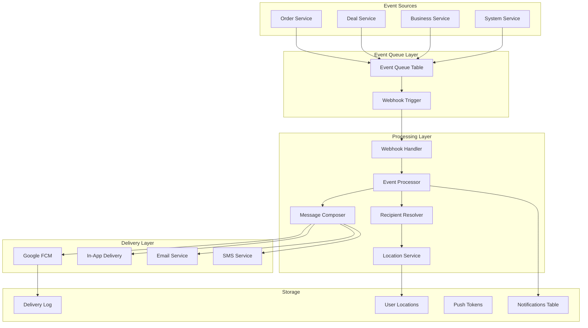

# FoodQ Notification System Design V2
## Event-Queue Based Architecture with Location Intelligence

## Executive Summary
A comprehensive, event-driven notification system utilizing an event queue pattern with webhook processing, Google FCM for push notifications, and intelligent location-based deal notifications. The system ensures reliable message delivery through asynchronous processing and provides complete testability via Postman.

## System Architecture Overview



## Database Schema

### 1. Event Queue Table (Source)
```sql
-- Core event queue table that triggers everything
CREATE TABLE event_queue (
  id UUID PRIMARY KEY DEFAULT uuid_generate_v4(),
  
  -- Event identification
  event_type VARCHAR(100) NOT NULL,
  event_name VARCHAR(200) NOT NULL,
  event_version VARCHAR(10) DEFAULT '1.0',
  
  -- Event payload
  payload JSONB NOT NULL,
  metadata JSONB DEFAULT '{}',
  
  -- Processing status
  status VARCHAR(20) DEFAULT 'pending' CHECK (status IN ('pending', 'processing', 'processed', 'failed', 'retry')),
  retry_count INTEGER DEFAULT 0,
  max_retries INTEGER DEFAULT 3,
  
  -- Error tracking
  error_message TEXT,
  error_details JSONB,
  
  -- Timestamps
  created_at TIMESTAMP WITH TIME ZONE DEFAULT CURRENT_TIMESTAMP,
  processed_at TIMESTAMP WITH TIME ZONE,
  next_retry_at TIMESTAMP WITH TIME ZONE,
  
  -- Indexes
  CONSTRAINT check_event_type CHECK (event_type IN (
    'ORDER_CREATED', 'ORDER_PAID', 'ORDER_CONFIRMED', 'ORDER_PREPARING', 
    'ORDER_READY', 'ORDER_COMPLETED', 'ORDER_CANCELLED',
    'DEAL_CREATED', 'DEAL_UPDATED', 'DEAL_EXPIRING', 'DEAL_EXPIRED',
    'BUSINESS_UPDATE', 'SYSTEM_ANNOUNCEMENT', 'LOCATION_BASED_DEAL'
  ))
);

-- Indexes for performance
CREATE INDEX idx_event_queue_status ON event_queue(status, created_at) WHERE status IN ('pending', 'retry');
CREATE INDEX idx_event_queue_type ON event_queue(event_type, created_at DESC);
CREATE INDEX idx_event_queue_retry ON event_queue(next_retry_at) WHERE status = 'retry';

-- Function to notify webhook on insert
CREATE OR REPLACE FUNCTION notify_event_queue_webhook()
RETURNS TRIGGER AS $$
DECLARE
  webhook_payload JSONB;
BEGIN
  -- Prepare webhook payload
  webhook_payload := jsonb_build_object(
    'eventId', NEW.id,
    'eventType', NEW.event_type,
    'eventName', NEW.event_name,
    'payload', NEW.payload,
    'metadata', NEW.metadata,
    'timestamp', NEW.created_at
  );
  
  -- Send webhook notification (using pg_net extension for Supabase)
  PERFORM net.http_post(
    url := current_setting('app.webhook_url', true) || '/api/notifications/process',
    headers := jsonb_build_object(
      'Content-Type', 'application/json',
      'X-Webhook-Secret', current_setting('app.webhook_secret', true)
    ),
    body := webhook_payload
  );
  
  -- Alternative: Use NOTIFY for local development
  PERFORM pg_notify('event_queue_channel', webhook_payload::text);
  
  RETURN NEW;
END;
$$ LANGUAGE plpgsql;

-- Trigger webhook on new events
CREATE TRIGGER event_queue_webhook_trigger
AFTER INSERT ON event_queue
FOR EACH ROW
EXECUTE FUNCTION notify_event_queue_webhook();
```

### 2. User Locations Table
```sql
-- Store user home and work locations for location-based notifications
CREATE TABLE user_locations (
  id UUID PRIMARY KEY DEFAULT uuid_generate_v4(),
  user_id UUID NOT NULL REFERENCES auth.users(id) ON DELETE CASCADE,
  
  -- Location details
  location_type VARCHAR(20) NOT NULL CHECK (location_type IN ('home', 'work', 'other')),
  address TEXT NOT NULL,
  latitude DECIMAL(10, 8) NOT NULL,
  longitude DECIMAL(11, 8) NOT NULL,
  
  -- Geospatial data for efficient querying
  geom GEOGRAPHY(POINT, 4326) GENERATED ALWAYS AS (ST_MakePoint(longitude, latitude)::geography) STORED,
  
  -- Notification preferences for this location
  notification_radius_km INTEGER DEFAULT 5,
  active BOOLEAN DEFAULT true,
  
  -- Metadata
  label VARCHAR(100),
  created_at TIMESTAMP WITH TIME ZONE DEFAULT CURRENT_TIMESTAMP,
  updated_at TIMESTAMP WITH TIME ZONE DEFAULT CURRENT_TIMESTAMP,
  
  -- Ensure one home and one work location per user
  CONSTRAINT unique_user_location_type UNIQUE (user_id, location_type)
);

-- Spatial index for location queries
CREATE INDEX idx_user_locations_geom ON user_locations USING GIST (geom);
CREATE INDEX idx_user_locations_user ON user_locations(user_id, active);

-- Function to find users near a location
CREATE OR REPLACE FUNCTION find_users_near_location(
  p_latitude DECIMAL,
  p_longitude DECIMAL,
  p_radius_km INTEGER DEFAULT 5
)
RETURNS TABLE(
  user_id UUID,
  distance_km DECIMAL,
  location_type VARCHAR
) AS $$
BEGIN
  RETURN QUERY
  SELECT 
    ul.user_id,
    ST_Distance(ul.geom, ST_MakePoint(p_longitude, p_latitude)::geography) / 1000 AS distance_km,
    ul.location_type
  FROM user_locations ul
  WHERE ul.active = true
    AND ST_DWithin(
      ul.geom,
      ST_MakePoint(p_longitude, p_latitude)::geography,
      LEAST(p_radius_km, ul.notification_radius_km) * 1000 -- Convert km to meters
    )
  ORDER BY distance_km;
END;
$$ LANGUAGE plpgsql;
```

### 3. Notifications Table (Enhanced)
```sql
CREATE TABLE notifications (
  id UUID PRIMARY KEY DEFAULT uuid_generate_v4(),
  
  -- Link to event
  event_id UUID REFERENCES event_queue(id),
  event_type VARCHAR(100) NOT NULL,
  
  -- Recipient
  recipient_id UUID NOT NULL REFERENCES auth.users(id),
  recipient_type VARCHAR(20) CHECK (recipient_type IN ('customer', 'business', 'staff')),
  
  -- Message content
  title TEXT NOT NULL,
  body TEXT NOT NULL,
  data JSONB DEFAULT '{}',
  image_url TEXT,
  action_url TEXT,
  
  -- FCM specific
  fcm_message_id TEXT,
  fcm_response JSONB,
  
  -- Delivery channels and status
  channels TEXT[] DEFAULT ARRAY['in_app'],
  delivery_status JSONB DEFAULT '{}', -- Track status per channel
  
  -- Location context (for location-based notifications)
  location_context JSONB, -- Contains distance, business location, etc.
  
  -- Tracking
  priority VARCHAR(10) DEFAULT 'normal' CHECK (priority IN ('low', 'normal', 'high', 'urgent')),
  is_read BOOLEAN DEFAULT FALSE,
  read_at TIMESTAMP WITH TIME ZONE,
  clicked_at TIMESTAMP WITH TIME ZONE,
  
  -- Timestamps
  created_at TIMESTAMP WITH TIME ZONE DEFAULT CURRENT_TIMESTAMP,
  sent_at TIMESTAMP WITH TIME ZONE,
  delivered_at TIMESTAMP WITH TIME ZONE,
  expires_at TIMESTAMP WITH TIME ZONE
);

-- Indexes
CREATE INDEX idx_notifications_recipient ON notifications(recipient_id, is_read, created_at DESC);
CREATE INDEX idx_notifications_event ON notifications(event_id);
CREATE INDEX idx_notifications_fcm ON notifications(fcm_message_id) WHERE fcm_message_id IS NOT NULL;
```

### 4. Push Tokens Table (FCM)
```sql
CREATE TABLE push_tokens (
  id UUID PRIMARY KEY DEFAULT uuid_generate_v4(),
  user_id UUID NOT NULL REFERENCES auth.users(id) ON DELETE CASCADE,
  
  -- FCM token details
  fcm_token TEXT NOT NULL,
  platform VARCHAR(10) NOT NULL CHECK (platform IN ('ios', 'android', 'web')),
  
  -- Device information
  device_id TEXT,
  device_model TEXT,
  app_version TEXT,
  
  -- Status
  is_active BOOLEAN DEFAULT true,
  last_used_at TIMESTAMP WITH TIME ZONE,
  
  -- Error tracking
  failure_count INTEGER DEFAULT 0,
  last_failure_at TIMESTAMP WITH TIME ZONE,
  last_failure_reason TEXT,
  
  created_at TIMESTAMP WITH TIME ZONE DEFAULT CURRENT_TIMESTAMP,
  updated_at TIMESTAMP WITH TIME ZONE DEFAULT CURRENT_TIMESTAMP,
  
  UNIQUE(user_id, fcm_token)
);

CREATE INDEX idx_push_tokens_user ON push_tokens(user_id, is_active);
CREATE INDEX idx_push_tokens_token ON push_tokens(fcm_token) WHERE is_active = true;
```

### 5. Delivery Log Table
```sql
CREATE TABLE delivery_log (
  id UUID PRIMARY KEY DEFAULT uuid_generate_v4(),
  notification_id UUID REFERENCES notifications(id),
  
  -- Delivery details
  channel VARCHAR(20) NOT NULL CHECK (channel IN ('fcm', 'in_app', 'email', 'sms')),
  status VARCHAR(20) NOT NULL CHECK (status IN ('pending', 'sent', 'delivered', 'failed', 'bounced')),
  
  -- Provider response
  provider_response JSONB,
  provider_message_id TEXT,
  
  -- Error details
  error_code TEXT,
  error_message TEXT,
  
  -- Timestamps
  attempted_at TIMESTAMP WITH TIME ZONE DEFAULT CURRENT_TIMESTAMP,
  delivered_at TIMESTAMP WITH TIME ZONE,
  
  -- Retry information
  retry_count INTEGER DEFAULT 0,
  next_retry_at TIMESTAMP WITH TIME ZONE
);

CREATE INDEX idx_delivery_log_notification ON delivery_log(notification_id, channel);
CREATE INDEX idx_delivery_log_status ON delivery_log(status, attempted_at DESC);
```

## Webhook Processing System

### Cloudflare Worker - Webhook Handler
```typescript
// functions/api/notifications/process.ts
import { initializeApp, cert } from 'firebase-admin/app';
import { getMessaging, MulticastMessage } from 'firebase-admin/messaging';

// Initialize Firebase Admin
const app = initializeApp({
  credential: cert({
    projectId: context.env.FIREBASE_PROJECT_ID,
    clientEmail: context.env.FIREBASE_CLIENT_EMAIL,
    privateKey: context.env.FIREBASE_PRIVATE_KEY.replace(/\\n/g, '\n'),
  }),
});

const messaging = getMessaging(app);

export async function onRequestPost(context) {
  const { env, request } = context;
  
  // Verify webhook secret
  const webhookSecret = request.headers.get('X-Webhook-Secret');
  if (webhookSecret !== env.WEBHOOK_SECRET) {
    return new Response('Unauthorized', { status: 401 });
  }
  
  const event = await request.json();
  
  try {
    // Process event based on type
    const processor = new EventProcessor(env);
    const result = await processor.process(event);
    
    // Update event queue status
    await updateEventStatus(env, event.eventId, 'processed');
    
    return new Response(JSON.stringify(result), {
      status: 200,
      headers: { 'Content-Type': 'application/json' }
    });
  } catch (error) {
    // Log error and update event status
    console.error('Event processing failed:', error);
    await updateEventStatus(env, event.eventId, 'failed', error.message);
    
    return new Response(JSON.stringify({ error: error.message }), {
      status: 500,
      headers: { 'Content-Type': 'application/json' }
    });
  }
}

class EventProcessor {
  constructor(private env: any) {}
  
  async process(event: any) {
    const { eventType, payload, metadata } = event;
    
    // Route to appropriate handler
    switch (eventType) {
      case 'ORDER_CREATED':
      case 'ORDER_PAID':
        return this.processOrderEvent(event);
      
      case 'ORDER_CONFIRMED':
        return this.processOrderConfirmed(event);
      
      case 'DEAL_CREATED':
        return this.processDealCreated(event);
      
      case 'LOCATION_BASED_DEAL':
        return this.processLocationBasedDeal(event);
      
      default:
        throw new Error(`Unknown event type: ${eventType}`);
    }
  }
  
  private async processOrderEvent(event: any) {
    const { orderId, businessId, customerId, amount, items } = event.payload;
    
    // Get business owner details
    const business = await this.getBusiness(businessId);
    
    // Compose message
    const message = {
      title: 'New Order Received!',
      body: `Order #${orderId.substring(0, 8)} - $${amount}`,
      data: {
        type: 'order',
        orderId,
        customerId,
        amount: amount.toString(),
        itemCount: items.length.toString(),
      },
    };
    
    // Get business owner's FCM tokens
    const tokens = await this.getUserTokens(business.owner_id);
    
    if (tokens.length > 0) {
      // Send FCM notification
      await this.sendFCMNotification(tokens, message);
    }
    
    // Save notification to database
    await this.saveNotification({
      event_id: event.eventId,
      event_type: event.eventType,
      recipient_id: business.owner_id,
      recipient_type: 'business',
      ...message,
    });
    
    return { success: true, recipients: 1 };
  }
  
  private async processOrderConfirmed(event: any) {
    const { orderId, customerId, verificationCode, pickupTime } = event.payload;
    
    // Compose message for customer
    const message = {
      title: 'Order Confirmed!',
      body: `Your order is confirmed. Pickup code: ${verificationCode}`,
      data: {
        type: 'order_confirmed',
        orderId,
        verificationCode,
        pickupTime,
      },
      image: event.payload.businessLogo,
    };
    
    // Get customer's FCM tokens
    const tokens = await this.getUserTokens(customerId);
    
    if (tokens.length > 0) {
      await this.sendFCMNotification(tokens, message);
    }
    
    // Save notification
    await this.saveNotification({
      event_id: event.eventId,
      event_type: event.eventType,
      recipient_id: customerId,
      recipient_type: 'customer',
      ...message,
    });
    
    return { success: true, recipients: 1 };
  }
  
  private async processDealCreated(event: any) {
    const { dealId, businessId, title, description, discount, expiresAt, location } = event.payload;
    
    // Find users near the business location
    const nearbyUsers = await this.findNearbyUsers(
      location.latitude,
      location.longitude,
      5 // 5km radius
    );
    
    // Filter users based on preferences
    const eligibleUsers = await this.filterUsersByPreferences(nearbyUsers, {
      dealCategory: event.payload.category,
      minDiscount: discount,
    });
    
    // Compose location-aware message
    const notifications = await Promise.all(
      eligibleUsers.map(async (user) => {
        const message = {
          title: `🔥 ${discount}% OFF Near You!`,
          body: `${title} - Only ${user.distance_km.toFixed(1)}km away! ${description}`,
          data: {
            type: 'deal',
            dealId,
            businessId,
            distance: user.distance_km.toString(),
            expiresAt,
          },
          image: event.payload.imageUrl,
        };
        
        // Get user's FCM tokens
        const tokens = await this.getUserTokens(user.user_id);
        
        if (tokens.length > 0) {
          await this.sendFCMNotification(tokens, message);
        }
        
        // Save notification with location context
        await this.saveNotification({
          event_id: event.eventId,
          event_type: 'DEAL_CREATED',
          recipient_id: user.user_id,
          recipient_type: 'customer',
          location_context: {
            distance_km: user.distance_km,
            user_location_type: user.location_type,
            business_location: location,
          },
          ...message,
        });
        
        return user.user_id;
      })
    );
    
    return { 
      success: true, 
      recipients: notifications.length,
      radius_km: 5 
    };
  }
  
  private async processLocationBasedDeal(event: any) {
    const { deals, targetLocation, radius } = event.payload;
    
    // This is for batch processing of multiple deals for users in an area
    const nearbyUsers = await this.findNearbyUsers(
      targetLocation.latitude,
      targetLocation.longitude,
      radius
    );
    
    // Group deals by distance and relevance
    const personalizedDeals = this.personalizeDealsForUsers(deals, nearbyUsers);
    
    // Send batch notifications
    const results = await Promise.all(
      personalizedDeals.map(async (userDeals) => {
        const { userId, deals } = userDeals;
        
        const message = {
          title: `📍 ${deals.length} Deals Near You!`,
          body: `Save up to ${Math.max(...deals.map(d => d.discount))}% at nearby restaurants`,
          data: {
            type: 'location_deals',
            dealCount: deals.length.toString(),
            deals: JSON.stringify(deals.slice(0, 3)), // Top 3 deals
          },
        };
        
        const tokens = await this.getUserTokens(userId);
        if (tokens.length > 0) {
          await this.sendFCMNotification(tokens, message);
        }
        
        return { userId, sent: true };
      })
    );
    
    return { 
      success: true, 
      recipients: results.length,
      radius_km: radius 
    };
  }
  
  private async sendFCMNotification(tokens: string[], message: any) {
    // Prepare FCM message
    const fcmMessage: MulticastMessage = {
      tokens,
      notification: {
        title: message.title,
        body: message.body,
        imageUrl: message.image,
      },
      data: message.data,
      android: {
        priority: 'high',
        notification: {
          sound: 'default',
          clickAction: 'FLUTTER_NOTIFICATION_CLICK',
        },
      },
      apns: {
        payload: {
          aps: {
            sound: 'default',
            badge: 1,
          },
        },
      },
    };
    
    try {
      const response = await messaging.sendMulticast(fcmMessage);
      
      // Log results
      if (response.failureCount > 0) {
        const failedTokens = [];
        response.responses.forEach((resp, idx) => {
          if (!resp.success) {
            failedTokens.push(tokens[idx]);
            console.error(`FCM failure for token ${tokens[idx]}:`, resp.error);
          }
        });
        
        // Mark failed tokens as inactive
        await this.deactivateTokens(failedTokens);
      }
      
      return response;
    } catch (error) {
      console.error('FCM send error:', error);
      throw error;
    }
  }
  
  private async findNearbyUsers(latitude: number, longitude: number, radiusKm: number) {
    const query = `
      SELECT 
        user_id,
        distance_km,
        location_type
      FROM find_users_near_location($1, $2, $3)
    `;
    
    const result = await this.env.DB.prepare(query)
      .bind(latitude, longitude, radiusKm)
      .all();
    
    return result.results;
  }
  
  private async getUserTokens(userId: string): Promise<string[]> {
    const query = `
      SELECT fcm_token 
      FROM push_tokens 
      WHERE user_id = $1 
        AND is_active = true 
        AND failure_count < 3
    `;
    
    const result = await this.env.DB.prepare(query)
      .bind(userId)
      .all();
    
    return result.results.map(r => r.fcm_token);
  }
  
  private async saveNotification(notification: any) {
    const query = `
      INSERT INTO notifications (
        event_id, event_type, recipient_id, recipient_type,
        title, body, data, image_url, location_context,
        channels, priority
      ) VALUES ($1, $2, $3, $4, $5, $6, $7, $8, $9, $10, $11)
      RETURNING id
    `;
    
    const result = await this.env.DB.prepare(query)
      .bind(
        notification.event_id,
        notification.event_type,
        notification.recipient_id,
        notification.recipient_type,
        notification.title,
        notification.body,
        JSON.stringify(notification.data || {}),
        notification.image || null,
        JSON.stringify(notification.location_context || null),
        JSON.stringify(['fcm', 'in_app']),
        notification.priority || 'normal'
      )
      .first();
    
    return result.id;
  }
}
```

## Event Creation Functions

### Order Event Creation
```sql
-- Function to create order events
CREATE OR REPLACE FUNCTION create_order_event()
RETURNS TRIGGER AS $$
BEGIN
  -- Insert event based on order status change
  IF TG_OP = 'INSERT' THEN
    INSERT INTO event_queue (event_type, event_name, payload, metadata)
    VALUES (
      'ORDER_CREATED',
      'New order created',
      jsonb_build_object(
        'orderId', NEW.id,
        'businessId', NEW.business_id,
        'customerId', NEW.user_id,
        'amount', NEW.total_amount,
        'items', NEW.items,
        'createdAt', NEW.created_at
      ),
      jsonb_build_object(
        'source', 'order_trigger',
        'version', '1.0'
      )
    );
  ELSIF TG_OP = 'UPDATE' THEN
    -- Check for status changes
    IF OLD.status != NEW.status THEN
      INSERT INTO event_queue (event_type, event_name, payload, metadata)
      VALUES (
        CASE NEW.status
          WHEN 'paid' THEN 'ORDER_PAID'
          WHEN 'confirmed' THEN 'ORDER_CONFIRMED'
          WHEN 'preparing' THEN 'ORDER_PREPARING'
          WHEN 'ready' THEN 'ORDER_READY'
          WHEN 'completed' THEN 'ORDER_COMPLETED'
          WHEN 'cancelled' THEN 'ORDER_CANCELLED'
        END,
        'Order status changed to ' || NEW.status,
        jsonb_build_object(
          'orderId', NEW.id,
          'businessId', NEW.business_id,
          'customerId', NEW.user_id,
          'oldStatus', OLD.status,
          'newStatus', NEW.status,
          'amount', NEW.total_amount,
          'verificationCode', NEW.verification_code,
          'pickupTime', NEW.pickup_time,
          'updatedAt', NEW.updated_at
        ),
        jsonb_build_object(
          'source', 'order_trigger',
          'version', '1.0',
          'previousStatus', OLD.status
        )
      );
    END IF;
  END IF;
  
  RETURN NEW;
END;
$$ LANGUAGE plpgsql;

-- Trigger for order events
CREATE TRIGGER order_event_trigger
AFTER INSERT OR UPDATE ON orders
FOR EACH ROW
EXECUTE FUNCTION create_order_event();
```

### Deal Event Creation with Location
```sql
-- Function to create deal events with location awareness
CREATE OR REPLACE FUNCTION create_deal_event()
RETURNS TRIGGER AS $$
DECLARE
  business_location RECORD;
BEGIN
  -- Get business location
  SELECT latitude, longitude, address
  INTO business_location
  FROM businesses
  WHERE id = NEW.business_id;
  
  IF TG_OP = 'INSERT' THEN
    -- Create deal created event
    INSERT INTO event_queue (event_type, event_name, payload, metadata)
    VALUES (
      'DEAL_CREATED',
      'New deal created',
      jsonb_build_object(
        'dealId', NEW.id,
        'businessId', NEW.business_id,
        'title', NEW.title,
        'description', NEW.description,
        'originalPrice', NEW.original_price,
        'discountedPrice', NEW.discounted_price,
        'discount', ROUND(((NEW.original_price - NEW.discounted_price) / NEW.original_price * 100)::numeric, 0),
        'category', NEW.category,
        'imageUrl', NEW.image_url,
        'expiresAt', NEW.expires_at,
        'location', jsonb_build_object(
          'latitude', business_location.latitude,
          'longitude', business_location.longitude,
          'address', business_location.address
        )
      ),
      jsonb_build_object(
        'source', 'deal_trigger',
        'version', '1.0',
        'notificationRadius', 5 -- Default 5km radius
      )
    );
    
    -- Check if deal is expiring soon (within 2 hours)
    IF NEW.expires_at <= CURRENT_TIMESTAMP + INTERVAL '2 hours' THEN
      INSERT INTO event_queue (event_type, event_name, payload, metadata)
      VALUES (
        'DEAL_EXPIRING',
        'Deal expiring soon',
        jsonb_build_object(
          'dealId', NEW.id,
          'businessId', NEW.business_id,
          'title', NEW.title,
          'expiresIn', EXTRACT(EPOCH FROM (NEW.expires_at - CURRENT_TIMESTAMP)),
          'location', jsonb_build_object(
            'latitude', business_location.latitude,
            'longitude', business_location.longitude
          )
        ),
        jsonb_build_object(
          'source', 'deal_trigger',
          'version', '1.0',
          'urgency', 'high'
        )
      );
    END IF;
  END IF;
  
  RETURN NEW;
END;
$$ LANGUAGE plpgsql;

-- Trigger for deal events
CREATE TRIGGER deal_event_trigger
AFTER INSERT ON deals
FOR EACH ROW
EXECUTE FUNCTION create_deal_event();
```

## Location-Based Notification System

### Location Update Handler
```typescript
// functions/api/users/location.ts
export async function onRequestPost(context) {
  const { userId } = context.params;
  const { latitude, longitude, type = 'home', address } = await context.request.json();
  
  // Update user location
  const query = `
    INSERT INTO user_locations (user_id, location_type, latitude, longitude, address)
    VALUES ($1, $2, $3, $4, $5)
    ON CONFLICT (user_id, location_type) 
    DO UPDATE SET 
      latitude = $3, 
      longitude = $4, 
      address = $5,
      updated_at = CURRENT_TIMESTAMP
    RETURNING id
  `;
  
  await context.env.DB.prepare(query)
    .bind(userId, type, latitude, longitude, address)
    .run();
  
  // Trigger location-based deal check
  await checkDealsNearLocation(context.env, userId, latitude, longitude);
  
  return new Response(JSON.stringify({ success: true }), {
    status: 200,
    headers: { 'Content-Type': 'application/json' }
  });
}

async function checkDealsNearLocation(env, userId, latitude, longitude) {
  // Find active deals near this location
  const query = `
    SELECT 
      d.*,
      b.name as business_name,
      b.latitude as business_lat,
      b.longitude as business_lng,
      ST_Distance(
        ST_MakePoint(b.longitude, b.latitude)::geography,
        ST_MakePoint($2, $3)::geography
      ) / 1000 as distance_km
    FROM deals d
    JOIN businesses b ON d.business_id = b.id
    WHERE d.is_active = true
      AND d.expires_at > CURRENT_TIMESTAMP
      AND ST_DWithin(
        ST_MakePoint(b.longitude, b.latitude)::geography,
        ST_MakePoint($2, $3)::geography,
        5000 -- 5km radius
      )
    ORDER BY distance_km
    LIMIT 10
  `;
  
  const deals = await env.DB.prepare(query)
    .bind(latitude, longitude)
    .all();
  
  if (deals.results.length > 0) {
    // Create location-based deal event
    await createLocationBasedDealEvent(env, userId, deals.results, { latitude, longitude });
  }
}
```

### Scheduled Location-Based Notifications
```sql
-- Function to send daily location-based deal digest
CREATE OR REPLACE FUNCTION send_daily_location_deals()
RETURNS void AS $$
DECLARE
  user_record RECORD;
  deal_record RECORD;
  deals_array JSONB;
BEGIN
  -- For each user with an active location
  FOR user_record IN 
    SELECT DISTINCT 
      ul.user_id,
      ul.latitude,
      ul.longitude,
      ul.notification_radius_km,
      u.email,
      u.raw_user_meta_data->>'name' as name
    FROM user_locations ul
    JOIN auth.users u ON ul.user_id = u.id
    WHERE ul.active = true
      AND ul.location_type = 'home'
  LOOP
    deals_array := '[]'::jsonb;
    
    -- Find deals near user's home location
    FOR deal_record IN
      SELECT 
        d.*,
        b.name as business_name,
        ST_Distance(
          ST_MakePoint(b.longitude, b.latitude)::geography,
          ST_MakePoint(user_record.longitude, user_record.latitude)::geography
        ) / 1000 as distance_km
      FROM deals d
      JOIN businesses b ON d.business_id = b.id
      WHERE d.is_active = true
        AND d.expires_at > CURRENT_TIMESTAMP
        AND d.expires_at < CURRENT_TIMESTAMP + INTERVAL '24 hours'
        AND ST_DWithin(
          ST_MakePoint(b.longitude, b.latitude)::geography,
          ST_MakePoint(user_record.longitude, user_record.latitude)::geography,
          user_record.notification_radius_km * 1000
        )
      ORDER BY distance_km
      LIMIT 5
    LOOP
      deals_array := deals_array || jsonb_build_object(
        'dealId', deal_record.id,
        'title', deal_record.title,
        'businessName', deal_record.business_name,
        'distance', deal_record.distance_km,
        'discount', deal_record.discount_percentage,
        'expiresAt', deal_record.expires_at
      );
    END LOOP;
    
    -- If user has deals nearby, create event
    IF jsonb_array_length(deals_array) > 0 THEN
      INSERT INTO event_queue (event_type, event_name, payload, metadata)
      VALUES (
        'LOCATION_BASED_DEAL',
        'Daily deal digest',
        jsonb_build_object(
          'userId', user_record.user_id,
          'userName', user_record.name,
          'deals', deals_array,
          'locationLat', user_record.latitude,
          'locationLng', user_record.longitude
        ),
        jsonb_build_object(
          'source', 'scheduled_job',
          'version', '1.0',
          'schedule', 'daily_digest'
        )
      );
    END IF;
  END LOOP;
END;
$$ LANGUAGE plpgsql;

-- Schedule this function to run daily at 9 AM local time
-- This would be set up in Supabase using pg_cron extension
SELECT cron.schedule(
  'daily-location-deals',
  '0 9 * * *',
  'SELECT send_daily_location_deals();'
);
```

## Testing with Postman

### Postman Collection Structure
```json
{
  "info": {
    "name": "FoodQ Notification System",
    "description": "Complete testing suite for event-based notification system",
    "schema": "https://schema.getpostman.com/json/collection/v2.1.0/collection.json"
  },
  "auth": {
    "type": "bearer",
    "bearer": [
      {
        "key": "token",
        "value": "{{supabase_api_key}}",
        "type": "string"
      }
    ]
  },
  "variable": [
    {
      "key": "base_url",
      "value": "https://foodq.supabase.co/rest/v1"
    },
    {
      "key": "webhook_url",
      "value": "https://api.foodq.com/notifications/process"
    },
    {
      "key": "supabase_api_key",
      "value": "your_api_key_here"
    }
  ],
  "item": [
    {
      "name": "1. Event Queue Tests",
      "item": [
        {
          "name": "Create Order Event",
          "request": {
            "method": "POST",
            "header": [
              {
                "key": "apikey",
                "value": "{{supabase_api_key}}"
              },
              {
                "key": "Content-Type",
                "value": "application/json"
              }
            ],
            "body": {
              "mode": "raw",
              "raw": "{\n  \"event_type\": \"ORDER_CREATED\",\n  \"event_name\": \"Test Order Created\",\n  \"payload\": {\n    \"orderId\": \"{{$guid}}\",\n    \"businessId\": \"business_123\",\n    \"customerId\": \"customer_456\",\n    \"amount\": 25.99,\n    \"items\": [\n      {\n        \"name\": \"Burger\",\n        \"quantity\": 2,\n        \"price\": 12.99\n      }\n    ]\n  },\n  \"metadata\": {\n    \"source\": \"postman_test\",\n    \"timestamp\": \"{{$timestamp}}\"\n  }\n}"
            },
            "url": {
              "raw": "{{base_url}}/event_queue",
              "host": ["{{base_url}}"],
              "path": ["event_queue"]
            }
          },
          "response": [],
          "event": [
            {
              "listen": "test",
              "script": {
                "exec": [
                  "pm.test(\"Event created successfully\", function () {",
                  "    pm.response.to.have.status(201);",
                  "});",
                  "",
                  "pm.test(\"Webhook should be triggered\", function () {",
                  "    const jsonData = pm.response.json();",
                  "    pm.expect(jsonData).to.have.property('id');",
                  "    pm.environment.set('event_id', jsonData.id);",
                  "});"
                ]
              }
            }
          ]
        },
        {
          "name": "Create Deal Event with Location",
          "request": {
            "method": "POST",
            "header": [
              {
                "key": "apikey",
                "value": "{{supabase_api_key}}"
              }
            ],
            "body": {
              "mode": "raw",
              "raw": "{\n  \"event_type\": \"DEAL_CREATED\",\n  \"event_name\": \"Location Deal Test\",\n  \"payload\": {\n    \"dealId\": \"{{$guid}}\",\n    \"businessId\": \"business_123\",\n    \"title\": \"50% OFF Lunch Special\",\n    \"description\": \"Today only!\",\n    \"discount\": 50,\n    \"category\": \"lunch\",\n    \"location\": {\n      \"latitude\": 37.7749,\n      \"longitude\": -122.4194,\n      \"address\": \"123 Market St, San Francisco\"\n    },\n    \"expiresAt\": \"{{$isoTimestamp}}\"\n  }\n}",
              "options": {
                "raw": {
                  "language": "json"
                }
              }
            },
            "url": {
              "raw": "{{base_url}}/event_queue",
              "host": ["{{base_url}}"],
              "path": ["event_queue"]
            }
          }
        },
        {
          "name": "Verify Event Processing",
          "request": {
            "method": "GET",
            "header": [
              {
                "key": "apikey",
                "value": "{{supabase_api_key}}"
              }
            ],
            "url": {
              "raw": "{{base_url}}/event_queue?id=eq.{{event_id}}&select=*",
              "host": ["{{base_url}}"],
              "path": ["event_queue"],
              "query": [
                {
                  "key": "id",
                  "value": "eq.{{event_id}}"
                },
                {
                  "key": "select",
                  "value": "*"
                }
              ]
            }
          },
          "event": [
            {
              "listen": "test",
              "script": {
                "exec": [
                  "pm.test(\"Event should be processed\", function () {",
                  "    const jsonData = pm.response.json();",
                  "    pm.expect(jsonData[0].status).to.be.oneOf(['processing', 'processed']);",
                  "});"
                ]
              }
            }
          ]
        }
      ]
    },
    {
      "name": "2. Direct Webhook Tests",
      "item": [
        {
          "name": "Test Webhook - Order Notification",
          "request": {
            "method": "POST",
            "header": [
              {
                "key": "X-Webhook-Secret",
                "value": "{{webhook_secret}}"
              },
              {
                "key": "Content-Type",
                "value": "application/json"
              }
            ],
            "body": {
              "mode": "raw",
              "raw": "{\n  \"eventId\": \"{{$guid}}\",\n  \"eventType\": \"ORDER_CONFIRMED\",\n  \"eventName\": \"Order Confirmed Test\",\n  \"payload\": {\n    \"orderId\": \"order_789\",\n    \"customerId\": \"customer_456\",\n    \"verificationCode\": \"ABC123\",\n    \"pickupTime\": \"2024-01-01T12:30:00Z\"\n  },\n  \"metadata\": {\n    \"source\": \"postman_direct\"\n  }\n}"
            },
            "url": {
              "raw": "{{webhook_url}}",
              "host": ["{{webhook_url}}"]
            }
          }
        },
        {
          "name": "Test Location-Based Deal",
          "request": {
            "method": "POST",
            "header": [
              {
                "key": "X-Webhook-Secret",
                "value": "{{webhook_secret}}"
              }
            ],
            "body": {
              "mode": "raw",
              "raw": "{\n  \"eventId\": \"{{$guid}}\",\n  \"eventType\": \"LOCATION_BASED_DEAL\",\n  \"payload\": {\n    \"deals\": [\n      {\n        \"dealId\": \"deal_001\",\n        \"title\": \"Pizza Special\",\n        \"discount\": 30,\n        \"distance_km\": 0.5\n      },\n      {\n        \"dealId\": \"deal_002\",\n        \"title\": \"Sushi Combo\",\n        \"discount\": 25,\n        \"distance_km\": 1.2\n      }\n    ],\n    \"targetLocation\": {\n      \"latitude\": 37.7749,\n      \"longitude\": -122.4194\n    },\n    \"radius\": 5\n  }\n}",
              "options": {
                "raw": {
                  "language": "json"
                }
              }
            },
            "url": {
              "raw": "{{webhook_url}}",
              "host": ["{{webhook_url}}"]
            }
          }
        }
      ]
    },
    {
      "name": "3. Location Management",
      "item": [
        {
          "name": "Update User Home Location",
          "request": {
            "method": "POST",
            "header": [
              {
                "key": "Authorization",
                "value": "Bearer {{user_token}}"
              }
            ],
            "body": {
              "mode": "raw",
              "raw": "{\n  \"location_type\": \"home\",\n  \"latitude\": 37.7749,\n  \"longitude\": -122.4194,\n  \"address\": \"123 Main St, San Francisco, CA\",\n  \"notification_radius_km\": 5\n}",
              "options": {
                "raw": {
                  "language": "json"
                }
              }
            },
            "url": {
              "raw": "{{base_url}}/user_locations",
              "host": ["{{base_url}}"],
              "path": ["user_locations"]
            }
          }
        },
        {
          "name": "Find Nearby Users",
          "request": {
            "method": "POST",
            "header": [
              {
                "key": "apikey",
                "value": "{{supabase_api_key}}"
              }
            ],
            "body": {
              "mode": "raw",
              "raw": "{\n  \"latitude\": 37.7749,\n  \"longitude\": -122.4194,\n  \"radius_km\": 5\n}",
              "options": {
                "raw": {
                  "language": "json"
                }
              }
            },
            "url": {
              "raw": "{{base_url}}/rpc/find_users_near_location",
              "host": ["{{base_url}}"],
              "path": ["rpc", "find_users_near_location"]
            }
          }
        }
      ]
    },
    {
      "name": "4. FCM Token Management",
      "item": [
        {
          "name": "Register FCM Token",
          "request": {
            "method": "POST",
            "header": [
              {
                "key": "Authorization",
                "value": "Bearer {{user_token}}"
              }
            ],
            "body": {
              "mode": "raw",
              "raw": "{\n  \"fcm_token\": \"{{$randomAlphaNumeric}}\",\n  \"platform\": \"android\",\n  \"device_id\": \"device_{{$guid}}\",\n  \"device_model\": \"Pixel 7\",\n  \"app_version\": \"1.0.0\"\n}",
              "options": {
                "raw": {
                  "language": "json"
                }
              }
            },
            "url": {
              "raw": "{{base_url}}/push_tokens",
              "host": ["{{base_url}}"],
              "path": ["push_tokens"]
            }
          }
        }
      ]
    },
    {
      "name": "5. End-to-End Tests",
      "item": [
        {
          "name": "Complete Order Flow",
          "event": [
            {
              "listen": "prerequest",
              "script": {
                "exec": [
                  "// This would run the complete flow:",
                  "// 1. Create order",
                  "// 2. Update to paid",
                  "// 3. Business confirms",
                  "// 4. Mark as ready",
                  "// 5. Complete order",
                  "// Each step should trigger notifications"
                ]
              }
            }
          ]
        }
      ]
    }
  ]
}
```

### Test Scenarios

#### 1. Unit Test: Event Queue Insertion
```bash
# Direct database insertion test
curl -X POST 'https://your-supabase-url/rest/v1/event_queue' \
  -H "apikey: YOUR_SUPABASE_ANON_KEY" \
  -H "Content-Type: application/json" \
  -d '{
    "event_type": "ORDER_CREATED",
    "event_name": "Test Order",
    "payload": {
      "orderId": "test_123",
      "businessId": "biz_456",
      "customerId": "cust_789",
      "amount": 25.99
    }
  }'
```

#### 2. Integration Test: Complete Flow
```javascript
// Postman test script
pm.test("Complete notification flow", async function () {
    // Step 1: Create event
    const eventResponse = await pm.sendRequest({
        url: `${pm.variables.get("base_url")}/event_queue`,
        method: 'POST',
        header: {
            'apikey': pm.variables.get("supabase_api_key"),
            'Content-Type': 'application/json'
        },
        body: {
            mode: 'raw',
            raw: JSON.stringify({
                event_type: 'ORDER_CREATED',
                event_name: 'Integration Test',
                payload: {
                    orderId: pm.variables.replaceIn('{{$guid}}'),
                    businessId: 'test_business',
                    customerId: 'test_customer',
                    amount: 50.00
                }
            })
        }
    });
    
    pm.expect(eventResponse).to.have.property('code', 201);
    const eventId = eventResponse.json().id;
    
    // Step 2: Wait for processing
    setTimeout(() => {
        // Step 3: Check notification created
        pm.sendRequest({
            url: `${pm.variables.get("base_url")}/notifications?event_id=eq.${eventId}`,
            method: 'GET',
            header: {
                'apikey': pm.variables.get("supabase_api_key")
            }
        }, function (err, response) {
            pm.expect(response.json()).to.have.length.above(0);
            pm.expect(response.json()[0]).to.have.property('title');
        });
    }, 2000);
});
```

## Monitoring and Debugging

### Event Queue Dashboard Query
```sql
-- Real-time event queue monitoring
SELECT 
  event_type,
  status,
  COUNT(*) as count,
  AVG(EXTRACT(EPOCH FROM (processed_at - created_at))) as avg_processing_time,
  MAX(created_at) as last_event
FROM event_queue
WHERE created_at > CURRENT_TIMESTAMP - INTERVAL '1 hour'
GROUP BY event_type, status
ORDER BY count DESC;

-- Failed events requiring attention
SELECT 
  id,
  event_type,
  event_name,
  error_message,
  retry_count,
  created_at
FROM event_queue
WHERE status = 'failed'
  AND retry_count >= max_retries
ORDER BY created_at DESC
LIMIT 100;

-- Location-based notification effectiveness
SELECT 
  DATE(created_at) as date,
  COUNT(DISTINCT recipient_id) as unique_recipients,
  AVG((location_context->>'distance_km')::float) as avg_distance_km,
  COUNT(*) as total_notifications,
  SUM(CASE WHEN is_read THEN 1 ELSE 0 END) as read_count
FROM notifications
WHERE event_type = 'DEAL_CREATED'
  AND location_context IS NOT NULL
  AND created_at > CURRENT_DATE - INTERVAL '7 days'
GROUP BY DATE(created_at)
ORDER BY date DESC;
```

## Migration and Deployment Plan

### Phase 1: Infrastructure Setup (Day 1-2)
```bash
# 1. Create database tables
psql -f migrations/001_event_queue.sql
psql -f migrations/002_notifications.sql
psql -f migrations/003_user_locations.sql
psql -f migrations/004_push_tokens.sql

# 2. Deploy webhook handler
wrangler deploy --env production

# 3. Configure Firebase Admin SDK
firebase projects:list
firebase use your-project-id

# 4. Set environment variables
wrangler secret put FIREBASE_PROJECT_ID
wrangler secret put FIREBASE_CLIENT_EMAIL
wrangler secret put FIREBASE_PRIVATE_KEY
wrangler secret put WEBHOOK_SECRET
```

### Phase 2: Testing (Day 3-4)
- Run Postman collection tests
- Test location-based notifications
- Verify FCM delivery
- Load testing with multiple concurrent events

### Phase 3: Rollout (Day 5)
- Enable triggers on production
- Monitor event queue
- Check delivery rates
- Gather user feedback

## Summary

This enhanced design provides:

1. **Event Queue Architecture**: Reliable event processing with webhook triggers
2. **Location Intelligence**: Automatic location-based deal notifications
3. **Google FCM Integration**: Push notifications across all platforms
4. **Complete Testability**: Postman collection for all scenarios
5. **Scalability**: Asynchronous processing with retry logic
6. **Monitoring**: Comprehensive queries and dashboards

The system ensures no notification is lost, provides location-aware messaging, and maintains complete separation of concerns for easy maintenance and testing.